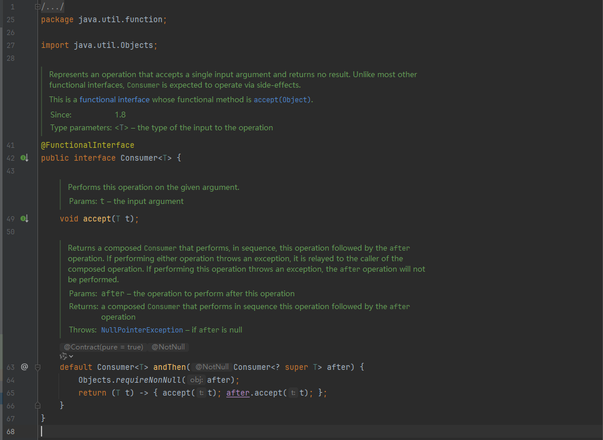
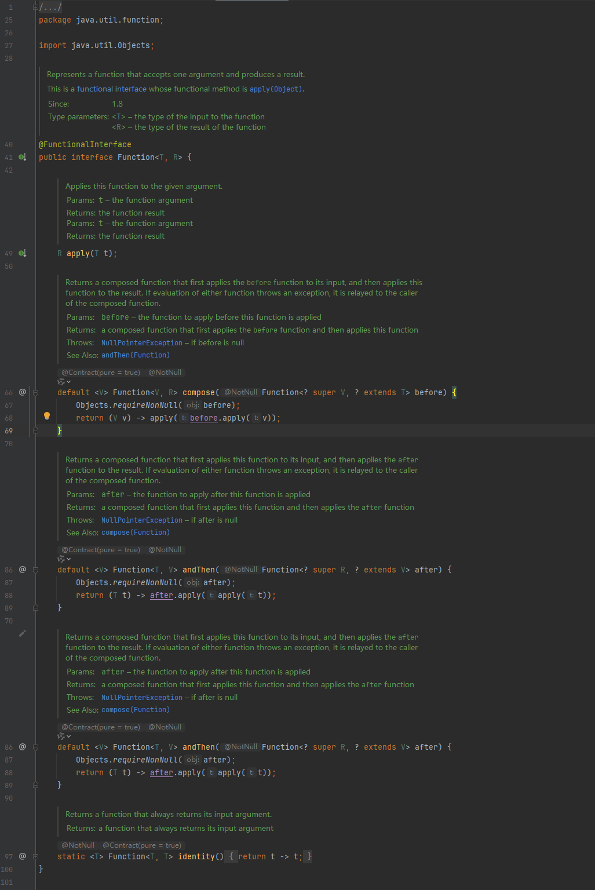
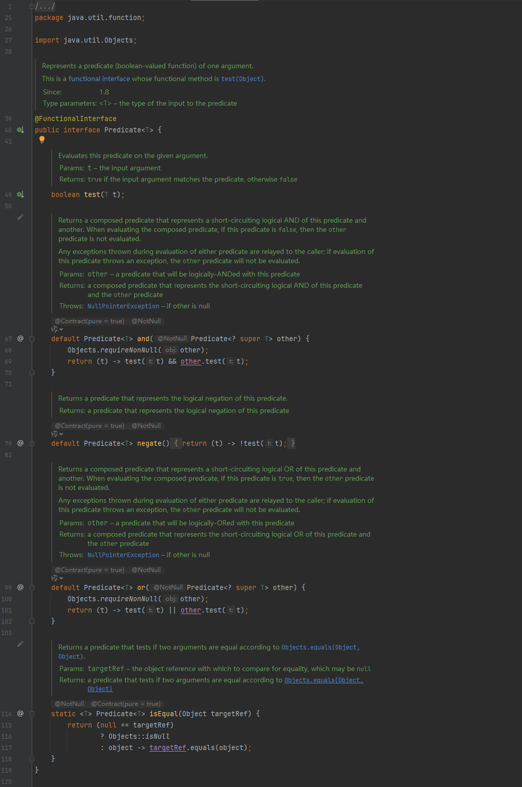
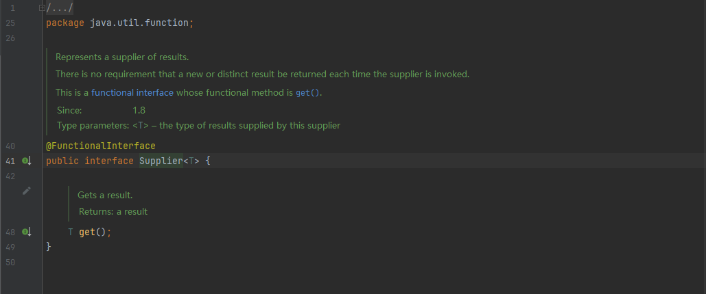

### 5 函数式接口

#### 5.1 概述

​       **只有一个抽象方法**的接口我们称之为函数式接口

​       JDK的函数式接口都加上了@FunctionalInterface注解进行标识。但是无论是否加上该注解只要接口中只有一个抽象方法，都是函数式接口。


#### 5.2 常见的函数式接口

- Consumer 消费接口

  根据其中的抽象方法的参数列表和返回值类型知道，我们可以在方法中对传入的参数进行消费。



- Function 计算转换接口

  根据其中抽象方法的参数列表和返回值类型知道，我们可以在方法中对传入的参数计算或转换，把结果返回。



- Predicate 判断类型接口

  根据抽象方法的参数列表和返回值类型知道，我们可以在方法中对传入的参数进行条件判断，返回判断结果。

  

- Suppller 生产型接口

  根据其中的抽象方法的参数列表和返回值类型知道，我们可以在方法中创建对象，把创建的对象返回。

  


#### 5.3 常用的默认方法

- and

  我们在使用Predicate接口时候可能需要进行判断条件的拼接。而and方法相当于是使用&&来拼接两个判断条件

  例如：

  打印作家中年龄大于等于17并且姓名的长度大于1的作家。

  ```java
  /**
   * 1、函数式接口的使用
   */
  @Test
  void functionInterface1() {
      //打印作家中年龄大于等于17并且姓名的长度大于1的作家。
      List<Author> authors = getAuthors();
      authors.stream()
              .filter(author -> author.getAge()>=18)
              .filter(author -> author.getName().length()>1)
             .forEach(author -> System.out.println(author.getName()+"今年"+author.getAge()+"岁了"));
  
      System.out.println("--------------------------");
  
      /**
       * and是Predicate的默认方法
       */
      authors.stream()
              .distinct()
              .filter(new Predicate<Author>() {
                  @Override
                  public boolean test(Author author) { //这个匿名内部类里面就相当于是一个Predicate对象
  
                      return author.getAge()>=17;
                  }
              }.and(new Predicate<Author>() { //调用对象里面的方法
                  @Override
                  public boolean test(Author author) {
                      return author.getName().length()>1;
                  }
              })).forEach(author -> System.out.println(author.getName()+"今年"+author.getAge()+"岁了"));
  
      System.out.println("--------------------------");
  
      //Lambda表达式优化
      authors.stream()
              .distinct()
              .filter(((Predicate<Author>) author -> author.getAge() >= 17)
                      .and(author -> author.getName().length()>1))
              .forEach(author -> System.out.println(author.getName()+"今年"+author.getAge()+"岁了"));
  
  }
  
  
  //它的主要用法是用在自己定义的时候
  public static void printNum(IntPredicate predicate,IntPredicate predicate2){
      int[] arr={1,2,3,4,5,6,7,8,9,10};
      for (int i : arr) {
          if(predicate.and(predicate2).test(i)){//and是Predicate的默认方法
              System.out.println(i);
          }
      }
  }
  
  /**
   * 2、函数式接口的使用
   */
  @Test
  void functionInterface2() {
      //要求获取i%2==0和i%3==0同时满足的数
      printNum(new IntPredicate() {
          @Override
          public boolean test(int value) {
              return value%2==0;
          }
      }.and(new IntPredicate() {
          @Override
          public boolean test(int value) {
              return value%3==0;
          }
      }));
  
  
      System.out.println("-----------------");
  
      //Lambda优化
      printNum(i -> i%2==0,i -> i%3==0);
  }
  ```

​     

- or

  我们在使用Predicate接口的时候可能需要进行判断条件的拼接，而or方法相当于是使用||来判断两个条件。

  例如：

  打印作家中年龄大于17或者姓名长度小于2的作家。

  ```java
  /**
   * 3、函数式接口的使用
   */
  @Test
  void functionInterface3() {
      //打印作家中年龄大于17或者姓名长度小于2的作家。
      List<Author> authors = getAuthors();
      authors.stream()
              .distinct()
              .filter(new Predicate<Author>() {
                  @Override
                  public boolean test(Author author) {
                      return author.getAge()>17;
                  }
              }.or(new Predicate<Author>() {
                  @Override
                  public boolean test(Author author) {
                      return author.getName().length()<2;
                  }
              })).forEach(System.out::println);
  
      System.out.println("--------------------------");
  
      //Lambda表达式优化
      authors.stream()
              .distinct()
              .filter(((Predicate<Author>) author -> author.getAge()>17)
                     .or(author -> author.getName().length()<2))
              .forEach(System.out::println);
  }
  ```

  

- negate

  Predicate接口中的方法，negate()方法相当于是在判断添加前面加了个！表示取反。

  例如：

  打印作家年龄不大于17的作家

  ```java
  /**
   * 4、函数式接口的使用
   */
   @Test
  void functionInterface4() {
       //打印作家年龄不大于17的作家
       List<Author> authors = getAuthors();
       authors.stream()
               .distinct()
               .filter(new Predicate<Author>() {
                   @Override
                   public boolean test(Author author) {
                       return author.getAge()>17;
                   }
               }.negate())
               .forEach(author -> System.out.println(author.getName()));
  
       System.out.println("-------------------------");
  
       authors.stream()
               .distinct()
               .filter(new Predicate<Author>() {
                   @Override
                   public boolean test(Author author) {
                       return !(author.getAge() >17);
                   }
               }).forEach(author -> System.out.println(author.getName()));
  
       System.out.println("-------------------------");
  
       //Lambda表达式优化
       authors.stream()
               .distinct()
               .filter(((Predicate<Author>) author -> author.getAge()>17 ).negate())
               .forEach(author -> System.out.println(author.getName()));
   }
  ```


